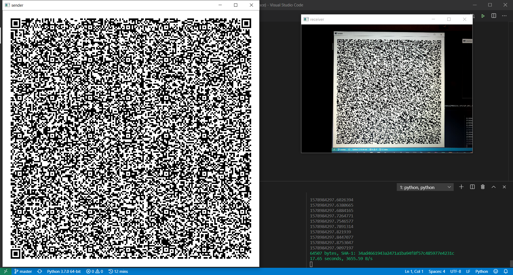

# blinqr
A prototype implementation of an unidirectional connectionless stateless data transfer protocol using QR and LT codes to send small files from a computer to a mobile device.



## Prerequisites
* Python 3.7
* zbar 0.10
* Tkinter
* DroidCam 6.0

## Installation
```bash
pip install -r requirements.txt
```

## Usage
```bash
python sender.py
```
```bash
python receiver.py
```

## Further development

**Performance**
* Parallelize QR codes generation
  * Consider switching to other low-level library
* Use RGB QR codes instead of standard QR codes
  * Create a native mobile app to resolve issues with color identification and focusing
* Find optimal combination of block size and data encoding method
* Resolve screen response time issues
  * Consider using a constant frame rate
* Differentiate transmissions by adding transmission ID

**User Experience**
* Improve GUI
* Show progress information and calculate ETA
* Allow sending entire directories by automatically compressing its contents into single .zip archive file

**Refactoring**
* Use Python streams
* Convert into package
  * Provide simple API for sending and receiving files
* Add tests and examples
